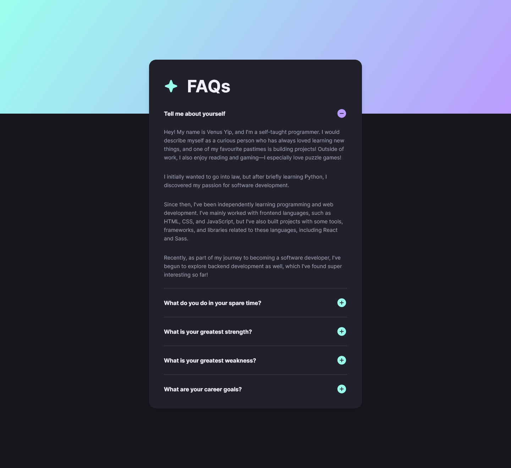
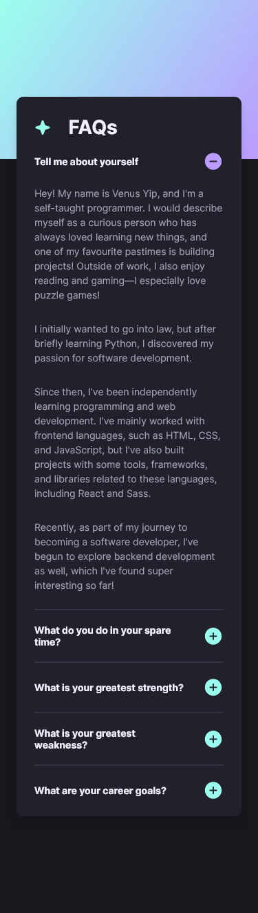

# FAQ Accordion

[Link to page](https://venusy.github.io/faq-accordion/)

A challenge from Frontend Mentor that I adapted into my personal FAQ page where I give answers to common interview questions!

## Table of Contents

- [Why I Built This Project](#why-i-built-this-project)
- [Preview](#preview)
  - [Desktop](#desktop)
  - [Mobile](#mobile)
- [Author](#author)

## Why I Built This Project

I built this project to gain more experience with building an FAQ accordion, which is a common frontend pattern.

The project was originally a challenge from Frontend Mentor, but I changed it to display common interview questions and my answers to them as I thought this was a good way to both practice my skills and display my creativity.

I decided to build this project with React and Sass to improve my skills in both technologies.

## Preview

### Desktop

### Mobile

## Author

- [My website](https://venusy.github.io/portfolio/)
- [Frontend Mentor](https://www.frontendmentor.io/profile/VenusY)
